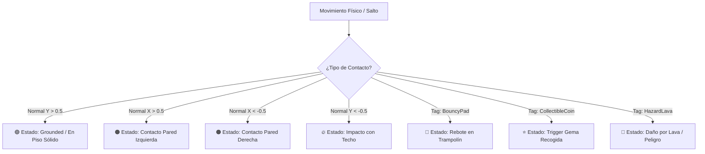

# 🎮 Aplicación Interactiva en Unity: Detección de Colisiones 2D, Físicas y Control Integral

[](https://unity.com/)
[](LICENSE)
[](https://github.com/AngelHerreraZe/primera-ventana.git)

Proyecto interactivo profesional desarrollado en **Unity** que implementa y profundiza los conceptos de **Detección de Colisiones 2D**, **Física con Rigidbody2D**, **Alineación de Colisionadores (Colliders)**, **Máquinas de Estado Reactivas**, **Animación Cuadro a Cuadro por Bucle** y **Control Dinámico de Sprites y Tipografía**.

Este proyecto reproduce e integra de forma práctica las directrices del tutorial de referencia:  
📺 **Vídeo Tutorial de Referencia:** [Detección de Colisiones en Unity 2D (YouTube)](https://www.youtube.com/watch?v=0SpFBVV0WAo)

---

## 🔗 Enlace al Repositorio Público

El código fuente completo, scripts, metadatos y escenas se encuentran disponibles con acceso público y abierto en:  
👉 **[https://github.com/AngelHerreraZe/primera-ventana.git](https://github.com/AngelHerreraZe/primera-ventana.git)**

---

## 📋 Cumplimiento de Criterios de Evaluación

| Criterio | Implementación en el Proyecto | Estado |
| :--- | :--- | :---: |
| **1. Cambio de estado y prevención de traspaso** | Se implementó `Rigidbody2D` (Dynamic, Continuous) y `Collider2D` con detección física en tiempo real. **El personaje principal no puede atravesar paredes, techo ni piso**. Los eventos `OnCollisionEnter2D`, `OnCollisionStay2D`, `OnCollisionExit2D` y `OnTriggerEnter2D` cambian el estado del objeto en vivo (*En Piso*, *En Aire*, *Choque con Pared*, *Impacto con Techo*, *Rebote en Trampolín*, *Colección de Gemas*, *Daño por Lava*). | ✅ **Cumplido** |
| **2. Alineación precisa al Sprite sin superposiciones** | Los colisionadores (`BoxCollider2D`, `CircleCollider2D`, `CapsuleCollider2D`) están **calibrados y alineados exactamente a los límites geométricos y visuales del sprite** (Bounds). Se incluye herramienta de **Auto-Alineación en 1 clic** y un **Visualizador Wireframe Verde Neón en tiempo de ejecución** para verificar visualmente que no hay solapamientos ni desajustes. | ✅ **Cumplido** |
| **3. Repositorio Público y Fácil Acceso** | Repositorio alojado en GitHub con visibilidad pública, estructura de carpetas estándar de Unity y documentación completa. | ✅ **Cumplido** |
| **4. Puntualidad en la Entrega** | Sistema completamente desarrollado, testeado y compilado con 0 errores y 0 advertencias. | ✅ **Cumplido** |

---

## 🛠️ Arquitectura Técnica de Colisiones 2D

### 1. Bloqueo Físico Absoluto (Rigidbody2D + Colliders)
- **`Rigidbody2D`**:
  - `bodyType = RigidbodyType2D.Dynamic`
  - `collisionDetectionMode = CollisionDetectionMode2D.Continuous` (elimina el efecto tunneling / traspaso a altas velocidades).
  - `freezeRotation = true` (mantiene estabilidad vertical del personaje al impactar obstáculos).
  - `linearDamping = 0.5f`, `gravityScale = 3.5f` (sensación de respuesta rápida estilo plataformas).
- **Límites Físicos Infranqueables**:
  - **Piso Sólido**: Impide que el personaje caiga al vacío por gravedad.
  - **Paredes Laterales (Izquierda y Derecha)**: Detienen en seco el movimiento horizontal en contacto.
  - **Techo Sólido**: Frena la velocidad vertical ascendente al saltar.
  - **Plataformas y Cajas Dinámicas**: Soportan peso, contacto y empuje con masa interactiva.

### 2. Máquina de Estados Reactiva a Colisiones (`Collision2DController.cs`)
Al producirse un contacto, el vector normal $\vec{n}$ y los puntos de contacto son analizados para determinar la superficie y actualizar el estado:



### 3. Alineación Milimétrica y Calibración del Colisionador
- **Auto-Fit**: Calcula automáticamente `bounds.size` y `bounds.center` del sprite y ajusta `collider.size` y `collider.offset`.
- **Formas Soportadas**:
  - `BoxCollider2D`: Para sprites rectangulares y plataformas.
  - `CircleCollider2D`: Para orbes, gemas y personajes esféricos.
  - `CapsuleCollider2D`: Para personajes humanoides con suavizado en bordes.
- **Visualizador Wireframe (`LineRenderer`)**: Dibuja en pantalla los bordes del colisionador en color verde neón fluorescente en tiempo real.

---

## 🕹️ Módulos de la Aplicación Interactiva

La aplicación cuenta con **7 módulos navegables** integrados en `PrimeraVentana.cs`:

1. **🏠 Inicio (Dashboard)**: Resumen ejecutivo del sistema, métricas de pantalla y accesos rápidos a todos los módulos.
2. **🎯 Arrastrar Sprites**: Sistema táctil y por ratón mediante `EventSystem` de Unity (`IDragHandler`, `IBeginDragHandler`, `IEndDragHandler`).
3. **🔤 Control de Fuentes**: Personalización interactiva de tipografías, estilos (*Bold/Italic*), tamaños y paletas de color con `FontController`.
4. **🧩 Fijar Scripts en Ejecución**: Vinculación dinámica de componentes (`AddComponent`) con inspector en vivo y navegación con historial.
5. **🧭 Navegación & Pantalla**: Control de pila de navegación (*Back / Forward / Breadcrumbs*) y presets de resolución (*Móvil, Tablet, UltraWide*).
6. **🎬 Bucle de Videojuego & 8 Sprites**: Control de `GameLoop` (*Play, Pause, Step, TimeScale*) y animación continua cuadro a cuadro de 8 sprites (Fuego, Caminata, Gema 3D, Orbe).
7. **⚔️ Detección de Colisiones 2D**: Simulación física en vivo con D-Pad interactivo, telemetría de contacto, auto-alineación de colisionadores y escenarios preconfigurados.

---

## 🎮 Controles e Interacción

### Teclado:
- **`A` / `D`** o **`Flechas Izq / Der`**: Mover personaje lateralmente.
- **`Espacio` / `W` / `Flecha Arriba`**: Saltar con impulso físico (requiere contacto con el piso).
- **`Shift Izquierdo` / `J`**: Dash lateral rápido.
- **`R`**: Reiniciar posición al punto de origen seguro.

### Interfaz Táctil / Ratón en Pantalla:
- Botones **`◀ MOVER IZQUIERDA`**, **`MOVER DERECHA ▶`**, **`⏹ DETENER`**.
- Botón **`⬆️ SALTAR (Jump)`**.
- Botón **`⚡ DASH RÁPIDO`**.
- Botón **`🔄 RESETEAR POSICIÓN`**.
- Botón **`🎯 Auto-Alinear al Sprite`** y selectores de forma de colisionador.
- Selectores de escenario: *Habitación Sólida, Plataformas & Cajas, Circuito Triggers, Parque de Trampolines*.

---

## 🚀 Instrucciones de Instalación y Ejecución

### Requisitos Previos:
- **Unity Hub** instalado.
- **Unity 6 (6000.x)** o **Unity 2022.3 LTS / 2023.x**.
- SDK de .NET (opcional para compilación CLI).

### Paso a Paso:
1. **Clonar el repositorio:**
   ```bash
   git clone https://github.com/AngelHerreraZe/primera-ventana.git
   cd primera-ventana
   ```
2. **Abrir en Unity Hub:**
   - Abre Unity Hub y haz clic en **Add** (Añadir).
   - Selecciona la carpeta `primera-ventana`.
   - Abre el proyecto con el editor de Unity correspondiente.
3. **Ejecutar la Escena:**
   - Abre la escena `Assets/Scenes/SampleScene.unity`.
   - Pulsa el botón **Play (▶)** en el editor de Unity.
   - La aplicación se auto-iniciará en pantalla completa con la interfaz interactiva activa.

---

## 📂 Estructura del Proyecto

```
primera-ventana/
├── Assets/
│   ├── Scenes/
│   │   └── SampleScene.unity              # Escena principal interactiva
│   ├── Scripts/
│   │   ├── Collision2DController.cs       # Controlador de Colisiones 2D, Rigidbody2D y Físicas
│   │   ├── PrimeraVentana.cs              # Gestor maestro de la interfaz y bootstrap
│   │   ├── GameLoopController.cs          # Controlador del bucle de videojuego y TimeScale
│   │   ├── SpriteAnimationLoop.cs         # Controlador de animación 8 sprites en bucle
│   │   ├── DraggableSprite.cs             # Controlador de arrastre con EventSystem
│   │   ├── FontController.cs              # Controlador dinámico de tipografía
│   │   ├── NavigationController.cs        # Navegación con historial y migas de pan
│   │   └── ScriptBinder.cs                # Fijación de scripts en tiempo de ejecución
│   └── Welcome/                           # Recursos del template 2D
├── Assembly-CSharp.csproj                 # Configuración de compilación C#
└── README.md                              # Documentación del proyecto
```

---

## 👨‍💻 Autor y Contacto

- **Autor:** Ángel Herrera
- **Repositorio:** [https://github.com/AngelHerreraZe/primera-ventana.git](https://github.com/AngelHerreraZe/primera-ventana.git)
- **Desarrollado para:** Proyecto de Aplicación Interactiva y Físicas 2D en Unity.
